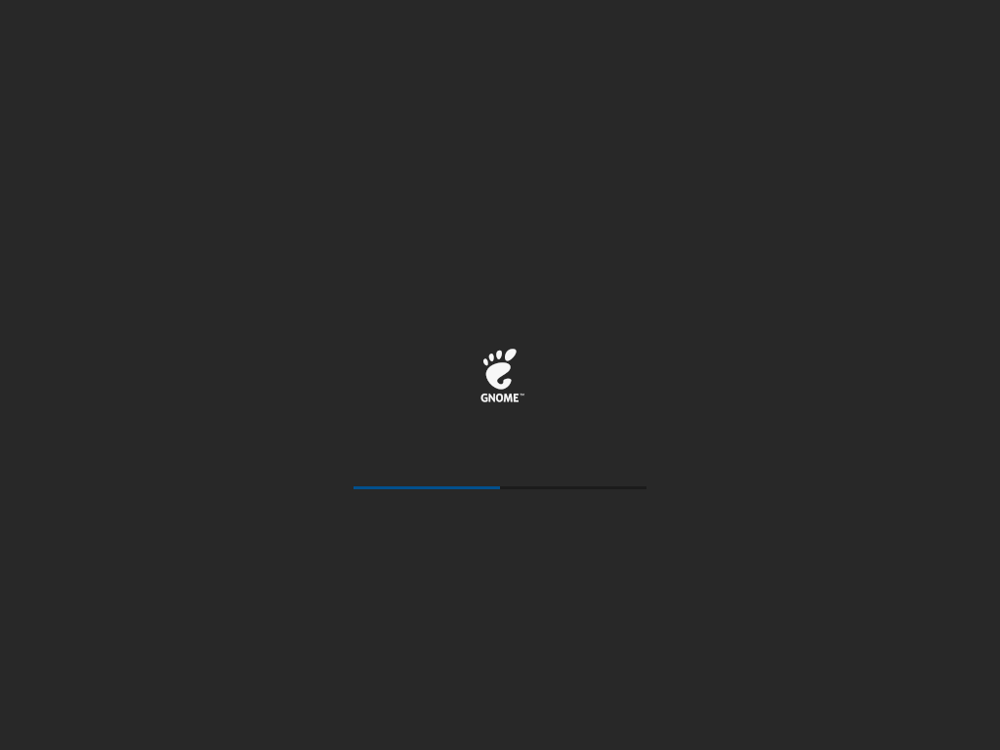
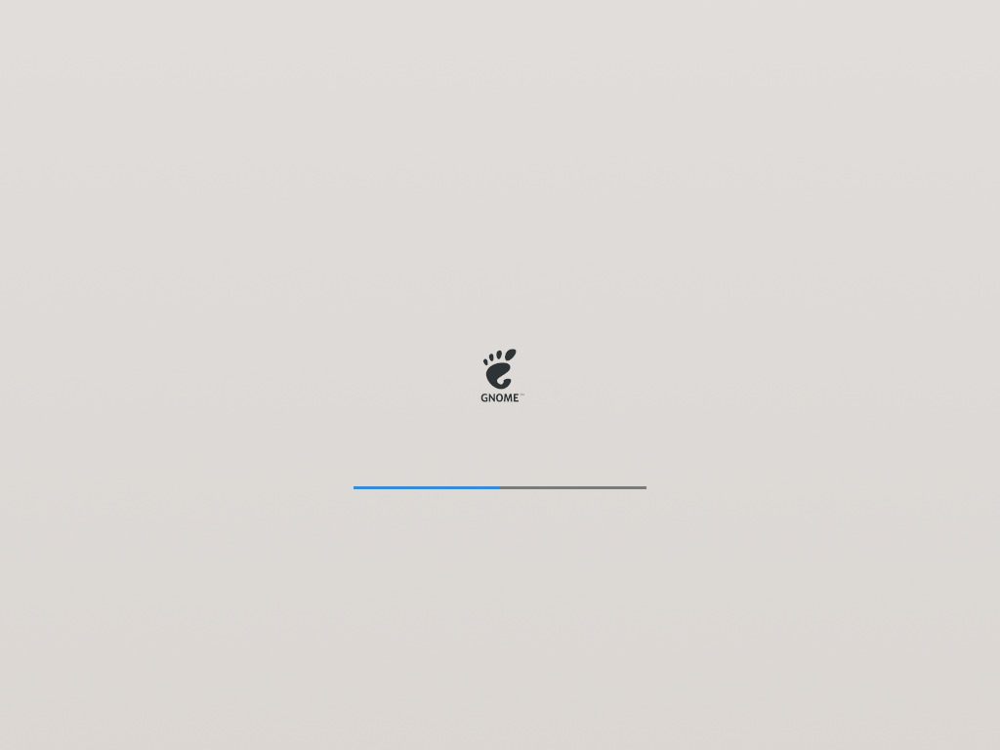
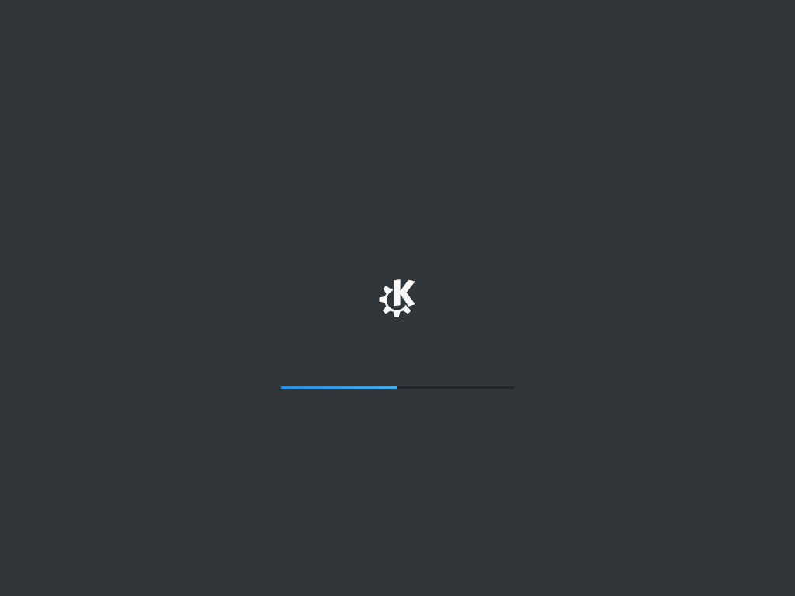
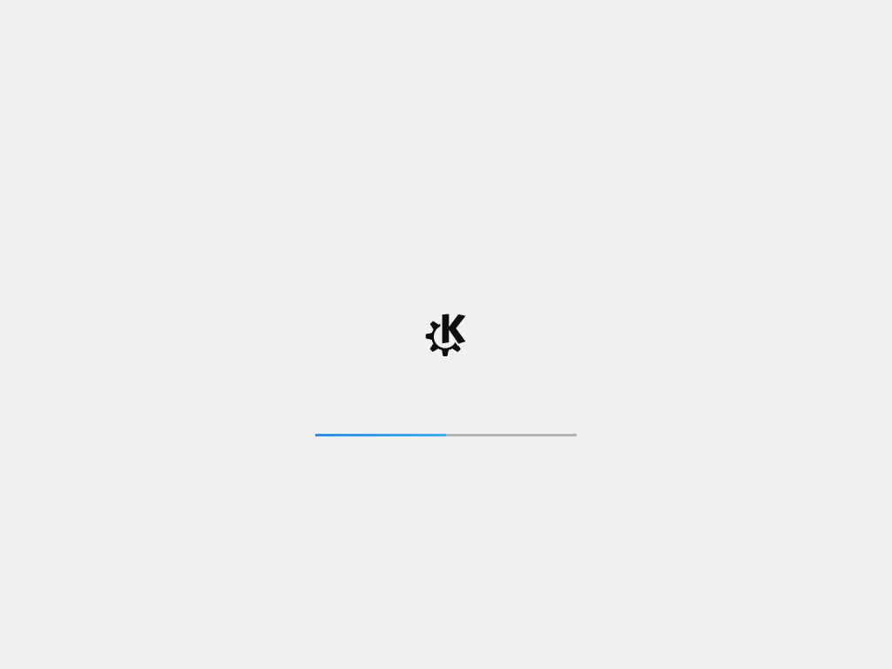
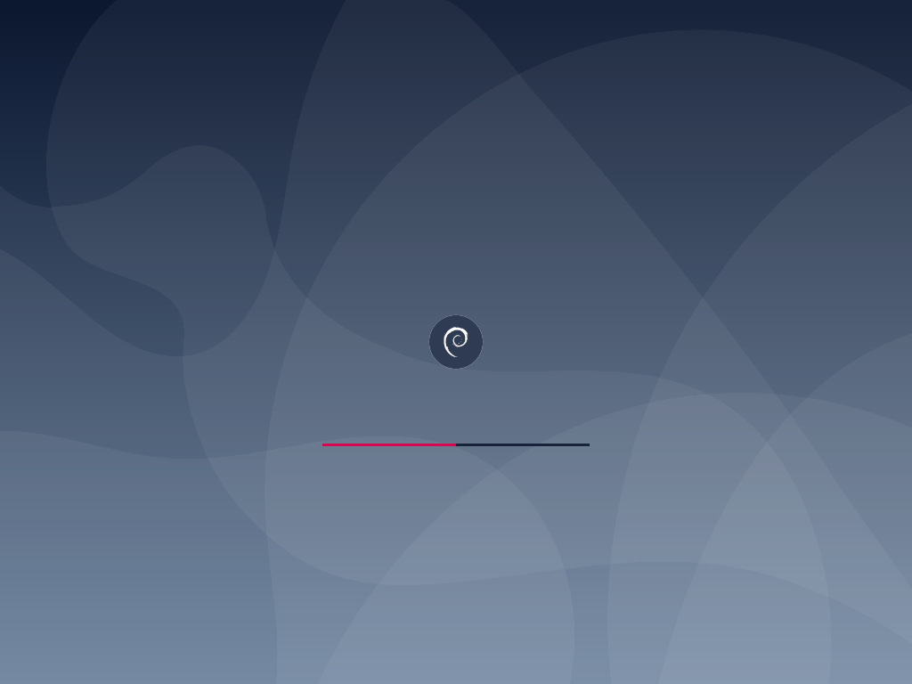
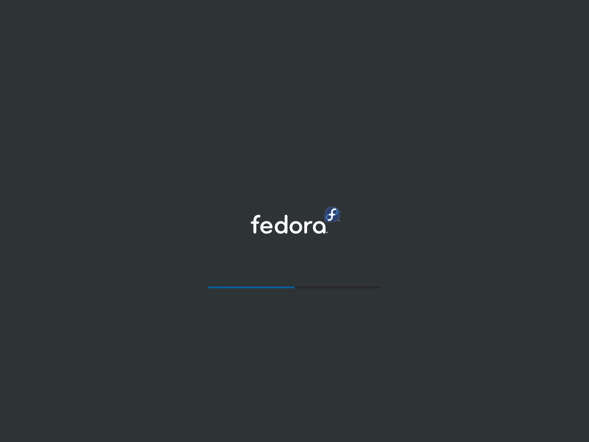
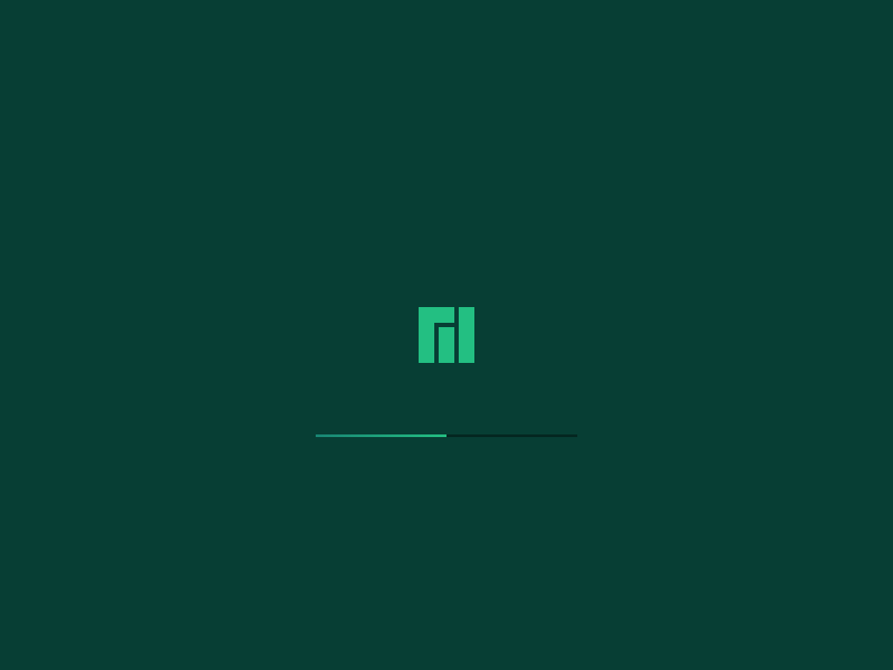
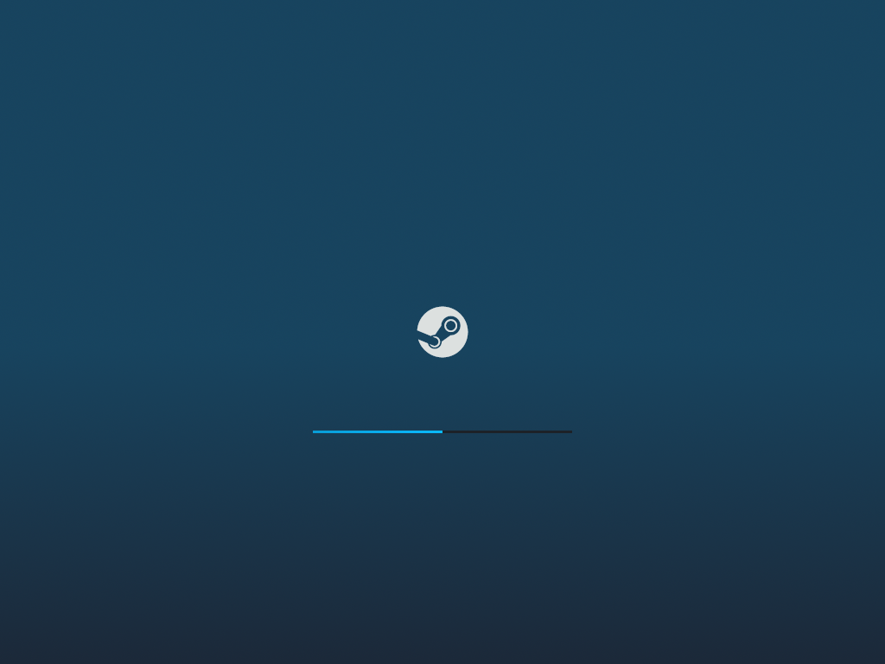
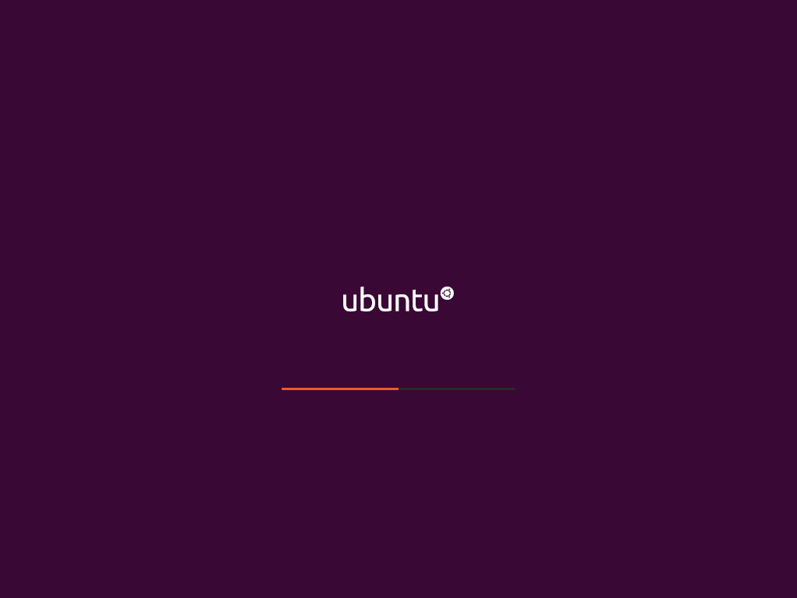

# Plymouth-Progress-Bar

Plymouth-Progress-Bar is a Plymoyth theme featuring a progress bar, available in various color schemes. It is based on **[Micheal Bearly's Apple Mac Plymouth Bar](https://www.opencode.net/mikebearly/apple-mac-plymouth)**

# Screenshots

**[Screenshots folder (including encryption prompt)](https://github.com/1deterministic/Plymouth-Progress-Bar/tree/master/screenshots)**

# Building
Just run `build.sh` from the project folder. It will create a folder called `build`, where all color schemes will be available with their own folders.
To generate screenshots Python 3 with the Pillow module is required. The generation of screenshots is enabled by default, but will only create 1024x768 images. More resolutions are available editing `create-screenshots.py`

# Editing
* Edit the `.xcf` files in `gimp-sources` with **[GIMP](https://www.gimp.org/)** to your liking.
* Export them as `.png` without changing the name, you can override existing files in `color-schemes` or create your own folder there.
* **The build script will only consider as a color scheme a folder inside another folder in `color-schemes`.** So, say you want to create a theme called my-theme. You could create `color-schemes/custom/my-theme`, and it would generate build/my-theme-custom based on it.
* The build script will also generate screenshots so you can preview your theme without rebooting.

# Installing
This will vary between distros, but the general rule is:
* Your `/etc/default/grub` must contain `quiet splash` in `GRUB_CMDLINE_LINUX=`
* Copy the theme to `/usr/share/plymouth/themes`
* Edit `/etc/plymouth/plymouth.conf`, changing `Theme=` to match your theme (e.g. `Theme=adwaita-blue-dark`)
* Regenerate your initramfs as well as your grub.cfg (on Debian/Ubuntu should be `update-initramfs -u` and `update-grub`, both as root)

## [1deterministic](https://github.com/1deterministic), 2019
